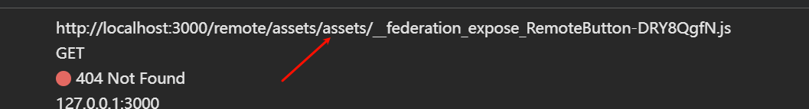
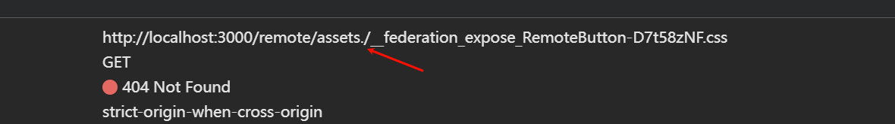
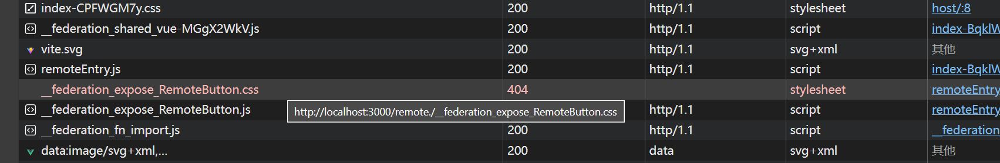

# BUG 复现demo

## 快速开始
```sh
pnpm run setup
pnpm run start
```

## 静态资源服务

通过 [server.js](file:///home/zhushuaibo/Temp/my-monorepo/server.js) 提供静态资源服务，访问路径如下：

- Remote App: `http://localhost:3000/remote`
- Host App: `http://localhost:3000/host`


## 1. 按照正常的配置会有问题

  js 会多一层 assets
  
  css 会多一层 assets会多个.
  


## 2.修改remote的构建配置后依旧无法结局css文件路径问题
  
  js加载正常，css路径依然没有解决掉
  
